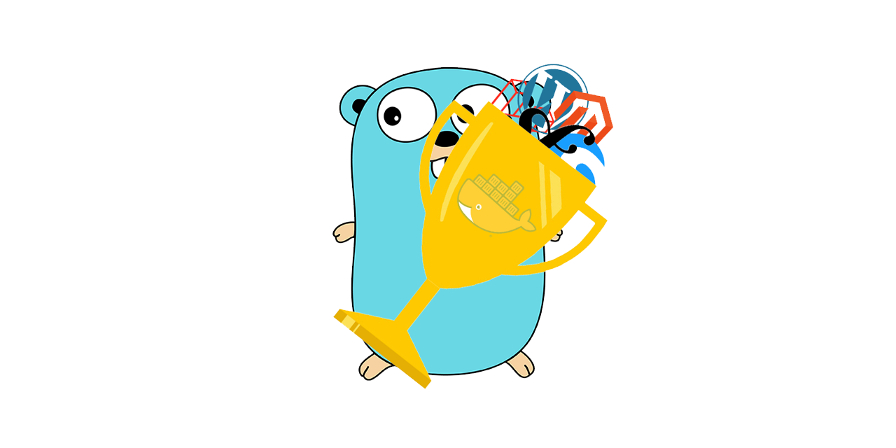
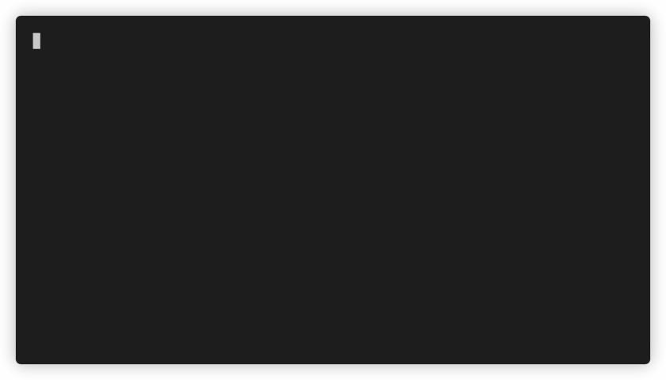

# Reward

<!-- include_open_start -->

Reward is a Swiss Army knife CLI utility for orchestrating Docker based development environments. It makes possible to
run multiple local environments simultaneously without port conflicts by utilizing common services proxying requests to
the correct environment's containers.

Reward is written in Go, and it supports Linux, macOS and Windows (and WSL2).
<!-- include_open_stop -->

Reward was inspired by Warden. See the Acknowledgment section for more info.

Reward was created under the aegis of [ITG Commerce](https://itgcommerce.com).

* [Documentation](https://rewardenv.readthedocs.io)
* [Installation](https://rewardenv.readthedocs.io/en/latest/installation.html)
* [Environments](https://rewardenv.readthedocs.io/en/latest/environments.html)
* [Docker Images](https://github.com/rewardenv/reward/tree/main/images)

## Features

- Traefik for SSL termination and routing/proxying requests into the correct containers.
- Portainer for quick visibility into what's running inside the local Docker host.
- Dnsmasq to serve DNS responses for `*.test` domains eliminating manual editing of `/etc/hosts`
- An SSH tunnel for connecting from Sequel Pro or TablePlus into any one of multiple running database containers.
- Reward issued wildcard SSL certificates for running https on all local development domains.
- A common PHPMyAdmin (or optionally Adminer) container for database management.
- An ElasticHQ container for the ability to manage the Elasticsearch Clusters.
- Full support for Magento 1, Magento 2, PWA Studio, Laravel, Symfony 4, Shopware 6, WordPress and more on all major
  operating systems
- Ability to override, extend, or setup completely custom environment definitions on a per-project basis.

<!-- include_open_stop -->

## Installation

Find out more: [Installation](https://rewardenv.readthedocs.io/en/latest/installation.html)

## Initializing WordPress

Find out
more: [Initializing WordPress](https://rewardenv.readthedocs.io/en/latest/environments/initializing-wordpress.html)

## Initializing Magento 2

Find out
more: [Initializing Magento 2](https://rewardenv.readthedocs.io/en/latest/environments/initializing-magento2.html)

## Contributing

All contributions to the Reward project are welcome: use-cases, documentation, code, patches, bug reports, feature
requests, etc. Any and all contributions may be made by submitting Issues and Pull Requests here on GitHub.

Please note that by submitting a pull request or otherwise contributing to the Reward project, you warrant that each of
your contributions is an original work and that you have full authority to grant rights to said contribution and by so
doing you grant the owners of the Reward project, and those who receive the contribution directly or indirectly, a
perpetual, worldwide, non-exclusive, royalty-free, irrevocable license to make, have made, use, offer to sell, sell and
import or otherwise dispose of the contributions alone or with the Reward project in its entirety.

## Join the Community

Do you have a question? Feel free to ask it! Join Reward's Slack community today!

[Join Slack](http://rewardslack.janosmiko.com)

## Author Information

This project was started in 2021 by Janos Miko.

Like my work?

## License

This work is licensed under the MIT license. See LICENSE file for details.

## Acknowledgement

Reward was inspired by Warden and most of its functionalities are reused/rewritten in Reward, so HUGE thanks to David
Alger and all the contributors for creating it.
<!-- include_open_stop -->

* [Warden's homepage](https://warden.dev)
* All images used for the logo are copyright to their respective owners.

## Stargazers over time

