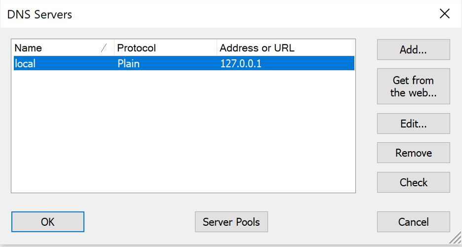
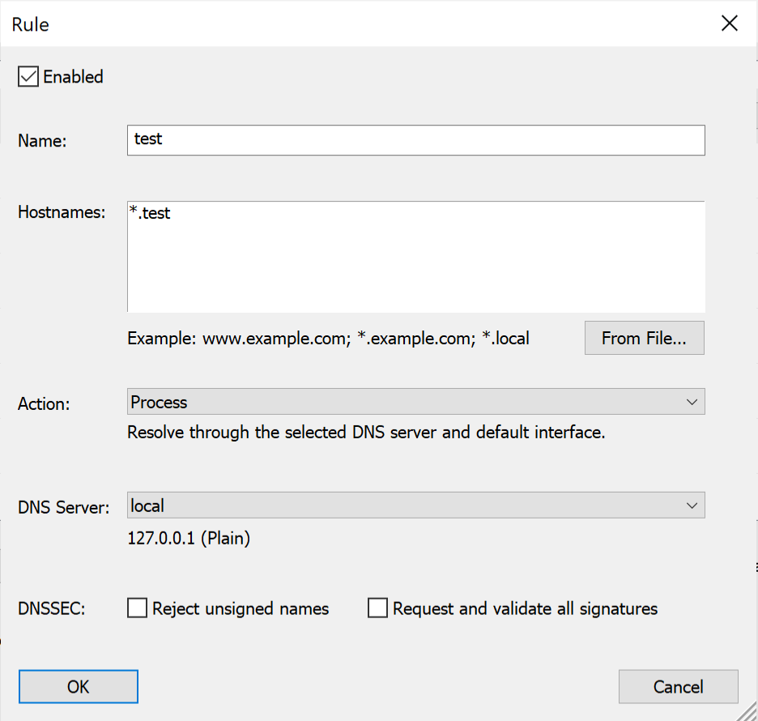

## Automatic DNS Resolution

In order to allow automatic DNS resolution using the provided dnsmasq service we will need to make sure DNS request are
routed through our local network. This requires some configuration.

### Windows

#### NRPT Rule

On Windows you can set custom DNS for a specific domain using NRPT Rules. You must execute commands in your PowerShell console with admin privileges.

To add the necesarry NRPT rule use the `Add-DnsClientNrptRule` command:
```PowerShell
> Add-DnsClientNrptRule -Namespace ".test" -NameServers "127.0.0.1"
```

If you'd like to remove the rule, get the list of all the rules using `Get-DnsClientNrptRule`:
```PowerShell
> Get-DnsClientNrptRule

Name                             : {RULE-NAME}
Version                          : 2
Namespace                        : {.test}
IPsecCARestriction               :
DirectAccessDnsServers           :
DirectAccessEnabled              : False
DirectAccessProxyType            :
DirectAccessProxyName            :
DirectAccessQueryIPsecEncryption :
DirectAccessQueryIPsecRequired   :
NameServers                      : 127.0.0.1
DnsSecEnabled                    : False
DnsSecQueryIPsecEncryption       :
DnsSecQueryIPsecRequired         :
DnsSecValidationRequired         :
NameEncoding                     : Disable
DisplayName                      :
Comment                          :
```

And then remove the rule using `Remove-DnsClientNrptRule`:
```PowerShell
> Remove-DnsClientNrptRule -Name "{RULE-NAME}"
```

It also works if you're using WSL2.

Source: https://superuser.com/a/1374119

#### YogaDNS

You will have to add a local DNS resolver and utilize dnsmasq to resolve the *.test domain.

Using Yoga DNS it's quite simple.

First add a local DNS server:



When you are done with the server configuration, you have to add a rule for *.test:



### Mac

On macOS, DNS resolution is configured automatically for `*.test` domains using a feature macOS inherits from BSD.
When `reward install` is run (or `reward svc up` for the first time) the following contents are placed in
the `/etc/resolver/test` file. This has the effect of having zero impact on DNS queries except for those under
the `.test` TLD.

```
nameserver 127.0.0.1
```

If you desire to have more than this route through the `dnsmasq` container, you could place another similar file in
the `/etc/resolver/` directory on a per-TLD basis, or alternatively configure all DNS lookups to pass through
the `dnsmasq` container. To do this, open up Advanced connection settings for the Wi-Fi/LAN settings in System
Preferences, and go to the DNS tab. In here press the "+" button to add a new DNS record with the following IP
address: `127.0.0.1` followed by fallback records:

```text
127.0.0.1
1.1.1.1
```

#### Bind dnsmasq container to both TCP and UDP ports

By default, only the UDP port 53 is exposed from the dnsmasq container. Sometimes it doesn't seem to be enough, and the
TCP port 53 has to be exposed as well. To do so enable the `reward_dnsmasq_bind_tcp` variable in the ~/.reward.yml file.

```yaml
reward_dnsmasq_bind_tcp: true
reward_dnsmasq_bind_udp: true
```

And restart the Reward services.

### Ubuntu

#### Per network

Open up your connection (Wi-Fi/LAN) settings, and go to the IPv4 tab. Turn off the automatic DNS setting, and enter the
following IP addresses

```text
127.0.0.1, 1.1.1.1
```

#### Persistent global configuration

To avoid having to set the DNS servers for each network you connect, you can also choose to update the global DNS
configuration.

Use the `resolvconf` service to add a permanent entry in your `/etc/resolv.conf` file.

Install resolvconf

```bash
sudo apt update && sudo apt install resolvconf
```

Edit the `/etc/resolvconf/resolv.conf.d/base` file as follows:

```text
search home net
nameserver 127.0.0.1
nameserver 1.1.1.1
```

Restart network-manager

```bash
sudo service network-manager restart
```

``` note::
    In the above examples you can replace ``1.1.1.1`` (CloudFlare) with the IP of your own preferred DNS resolution service such as ``8.8.8.8`` and ``8.8.4.4`` (Google) or ``9.9.9.9`` and ``149.112.112.112`` (Quad9)
```

### Fedora

#### Per network

Open up your connection (Wi-Fi/LAN) settings, and go to the IPv4 tab. Turn off the automatic DNS setting, and enter the
following IP addresses

```text
127.0.0.1, 1.1.1.1
```

#### Persistent global configuration

You should enable systemd-resolved and change your resolv.conf to be managed by systemd-resolved.

```
$ sudo systemctl start systemd-resolved
$ sudo systemctl enable systemd-resolved
$ sudo ln -sf ln -s /run/systemd/resolve/resolv.conf /etc/resolv.conf
```

When your systemd-resolved is ready, run reinstall reward's DNS settings and restart systemd-resolved.

```
$ reward install --dns
$ sudo systemctl restart systemd-resolved
```

### DNS resolution to Traefik inside docker network

By default, inside the environment's docker network the environment's hostname will be resolved to the traefik
container's IP address.

To change this behaviour you can disable it using the following setting in `~/.reward.yml`

```
reward_resolve_domain_to_traefik: false
```
