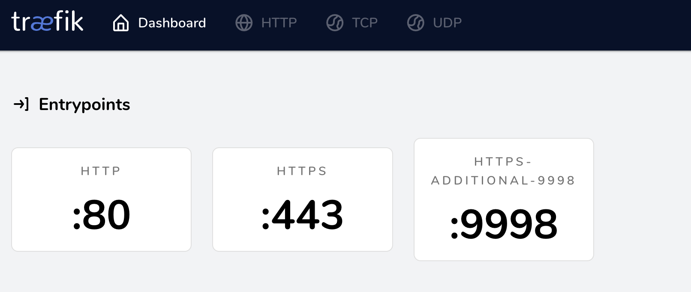

## Open additional shared http/https port(s)

It's possible to configure additional shared HTTP/s port(s) and proxy the requests to the PHP containers.

First, configure Traefik. Add the port to the Reward Configuration (default: `~/.reward.yml`).

```yaml
reward_traefik_bind_additional_http_ports: [ 8080 ]
reward_traefik_bind_additional_https_ports: [ 8443, 9998 ]
```

When it's done, restart Traefik.

```shell
reward svc down
reward svc up
```

Open [Traefik dashboard](https://traefik.reward.test) to check if the new port(s) exist in the entrypoints section.



When it's done configure this additional port on the PHP container as well. Add the following line to the
project's `.env` file. (It's also possible to add multiple ports, separated by comma.)

```
REWARD_HTTP_PROXY_PORTS=8080
REWARD_HTTPS_PROXY_PORTS=8443,9998
```

And restart the environment.

```shell
reward env down
reward env up
```
