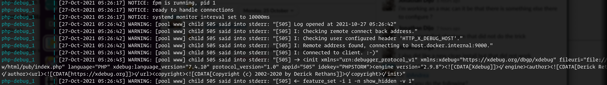

## Xdebug Support

There are two docker containers running FPM, `php-fpm` and `php-debug`. The `php-debug` container has the Xdebug
extension pre-installed. Nginx will automatically route requests to the `php-debug` container when the `XDEBUG_SESSION`
cookie has been set to `PHPSTORM` via the Xdebug Helper browser extension.

Xdebug will automatically connect back to the host machine on port `9000` for Xdebug2 and `9003` for Xdebug3 for each
request routed to the `php-debug` container (i.e. when the `XDEBUG_SESSION` cookie is set). When configuring Xdebug
Helper in your browser, make sure it is setting this cookie with the value `PHPSTORM`.

If you use a firewall, allow connection to port `9000` for Xdebug2 and `9003` for Xdebug3.

In similar fashion to the `reward shell` command there is also a debug command to launch into an xdebug enabled
container shell for debugging CLI workflows:

```
reward debug
```

### Xdebug Version

Reward supports both Xdebug 2 and Xdebug 3 (default).

If you'd like to use Xdebug version 2, you'll have to configure it explicitly. If it's empty or omitted, reward defaults
to Xdebug 3.

Add the following line to your `.env` file:

```
XDEBUG_VERSION=2
```

### VSCode

To configure a project in VSCode for debugging, add the following to `.vscode/launch.json` in the project directory:

```json
{
    "version": "0.2.0",
    "configurations": [
        {
            "name": "Listen for XDebug",
            "type": "php",
            "request": "launch",
            // Change this to 9000 if you are using Xdebug2
            "port": 9003,
            "pathMappings": {
                "/var/www/html": "${workspaceRoot}"
            }
        }
    ]
}
```

``` note::
    If your project has (for example) ``REWARD_WEB_ROOT=/webroot`` in it's ``.env`` file, to mount ``webroot/`` to ``/var/www/html`` rather than the top-level project directory, you may need to set the ``pathMapping`` above to ``${workspaceRoot}/webroot`` for the mapping to function correctly.
```

Once this configuration is in place, make sure you have
the [PHP Debug extension by Felix Becker](https://marketplace.visualstudio.com/items?itemName=felixfbecker.php-debug)
installed. This is required for Xdebug support to function in VSCode. Additional information on launch settings specific
to Xdebug use in VSCode [may be found here](https://github.com/felixfbecker/vscode-php-debug#vs-code-configuration).

To learn more about debugging in VSCode, [please go here](https://code.visualstudio.com/docs/editor/debugging).

### PhpStorm

When it receives the first request, PHP Storm should prompt you if the "Server" configuration is missing. The below
image demonstrates how this is set up; the important settings are these:

* Name: `clnt-docker` (this is the value of the `REWARD_ENV_NAME` variable in the `.env` file appended with a `-docker`
  suffix)
* Host: `127.0.0.1`
* Port: `80`
* Debugger: Xdebug
* Use path mappings must be enabled, with a mapping to map the project root on the host to `/var/www/html` within the
  container.


Additional configurations may be required, such as configuring ``DBGp Proxy`` port.


### Debugging PHP CLI Commands/Scripts

You can also debug PHP command line scripts using the following method.

```shell
# Open a shell in the environment debug container
reward debug

# Determine the Xdebug host address
php -i | grep -i 'xdebug.*host'

# The result was: 172.24.0.1

# Use the host address with the following example code to run bin/magento command.
# Xdebug2
php -dxdebug.remote_enable=1 -dxdebug.remote_mode=req -dxdebug.remote_port=9000 -dxdebug.remote_host=172.24.0.1 -dxdebug.remote_connect_back=0 bin/magento

# Xdebug3
php -dxdebug.mode=debug -dxdebug.client_host=172.24.0.1 -dxdebug.client_port=9003 -dxdebug.start_with_request=yes bin/magento
```

Source: [Debug a PHP CLI script](https://www.jetbrains.com/help/phpstorm/debugging-a-php-cli-script.html)

### Debugging Xdebug instance

```shell
reward debug
sudo bash
cd /etc/php/${PHP_VERSION}/mods-available
vim xdebug.ini
```

If you are not familiar with `vim`, you can use `nano` instead. Add the following line to the end of the configuration.

```shell
xdebug.remote_log=/proc/self/fd/2
```

Now save the file and reload the php-fpm configuration using `kill -USR2`

```shell
kill -USR2 1
```

Exit the container and check its logs.

```shell
reward env logs -f php-debug
```

You should see something like this.

