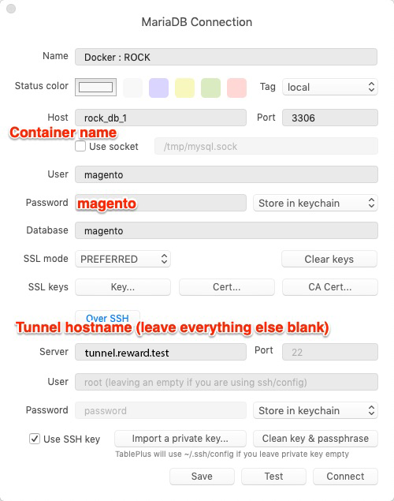
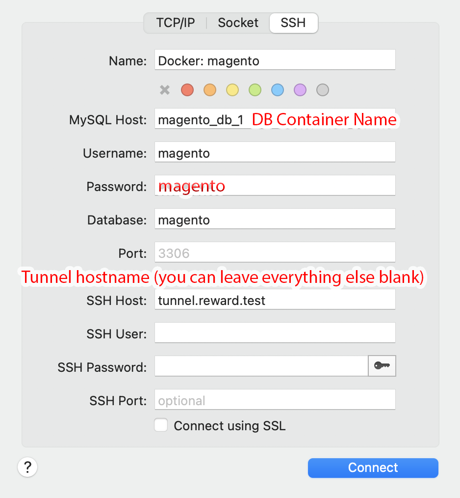
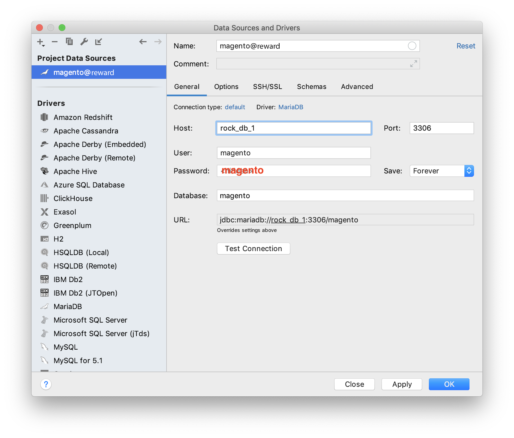
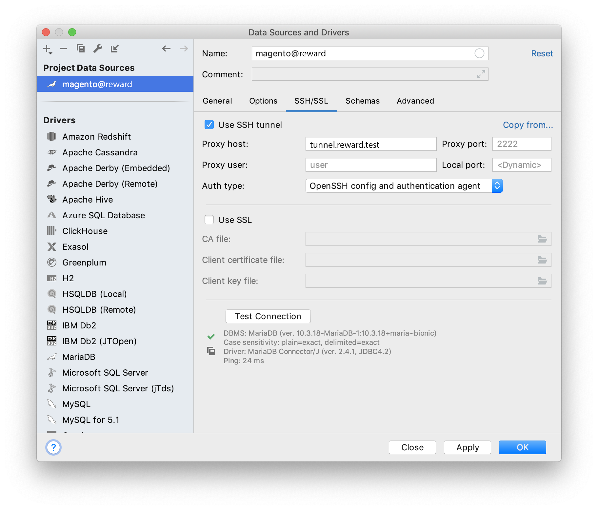
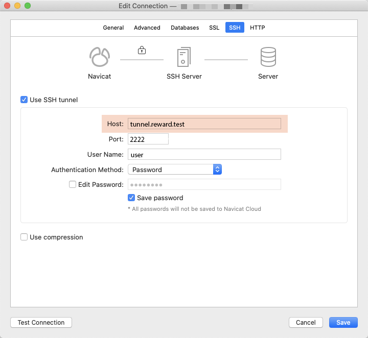

## Connect to the Database

### Common Settings

| Name                  | Value/Description                                                   |
|-----------------------|---------------------------------------------------------------------|
| MySQL Host            | Name of your Docker Container, can be found with `reward env ps db` |
| MySQL Port            | `3306`                                                              |
| MySQL User            | `magento`                                                           |
| MySQL Password        | `magento`                                                           |
| MySQL Database        | `magento`                                                           |
| SSH Tunnel Host       | `tunnel.reward.test`                                                |
| SSH Tunnel Port       | `2222`                                                              |
| SSH Tunnel User       | `user`                                                              |
| SSH Tunnel Key File   | *macOS or Linux* `~/.reward/tunnel/ssh_key`                         |
|                       | *Windows*         `C:\Users\user\.reward\tunnel\ssh_key`            |

``` note::
    On Windows use "Key pair Authentication" and select the SSH private key from
    Reward's home directory. See the example above.
```

### TablePlus



### Sequel Pro / Sequel Ace



### PhpStorm




### Navicat for MySQL



